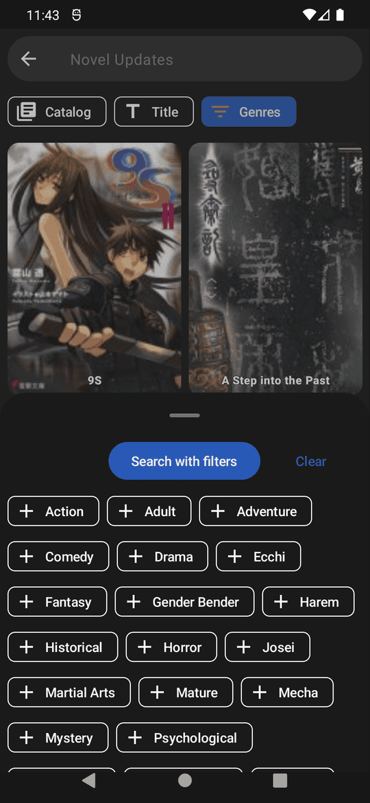
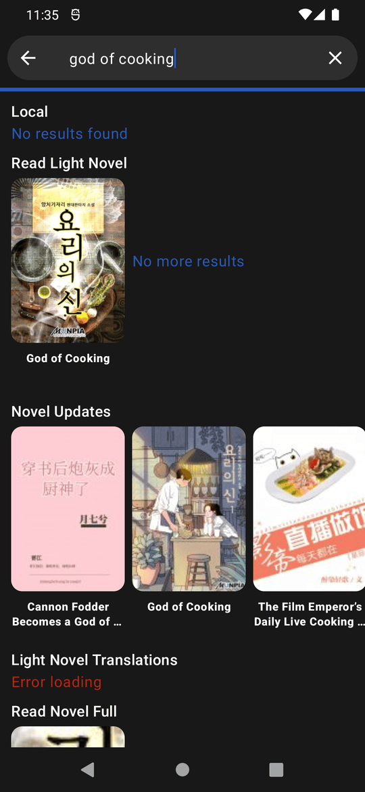

## ⚠️ Project Status: No Longer Maintained

This project is no longer actively maintained.
Feel free to fork it or use it as-is, but note that no further updates, bug fixes, or support will be done.

# NovelDokusha
Android web novel reader. Reader focused on simplicity, improving reading immersion.
Search from a large catalog of content, open your pick and just enjoy.

# License
Copyright © 2023, [nani](https://github.com/nanihadesuka), Released under [GPL-3](LICENSE) FOSS

## Features
  - Multiple sources from where to read novels
  - Multiple databases to search for novels
  - Local source to read local EPUBs
  - Easy backup and restore
  - Light and dark themes
  - Follows modern Material 3 guidelines
  - Reader
    - Infinite scroll
    - Custom font, font size
    - Live translation
    - Text to speech
      - Background playback
      - Adjust voice, pitch, speed
      - Save your preferred voices

  
## Screenshots
 
|              Library               |                Finder                |
|:----------------------------------:|:------------------------------------:|
|        |           |
|             Book info              |            Book chapters             |
|      |     |
|               Reader               |           Database search            |
|         |  |
|           Global search            |                                      |
|  |                                      |

## Tech stack
  - Kotlin
  - XML views
  - Jetpack compose
  - Material 3
  - Coroutines
  - LiveData
  - Room (SQLite) for storage
  - Jsoup
  - Okhttp
  - Coil, glide
  - Gson, Moshi
  - Google MLKit for translation
  - Android TTS
  - Android media (TTS playback notification controls)
