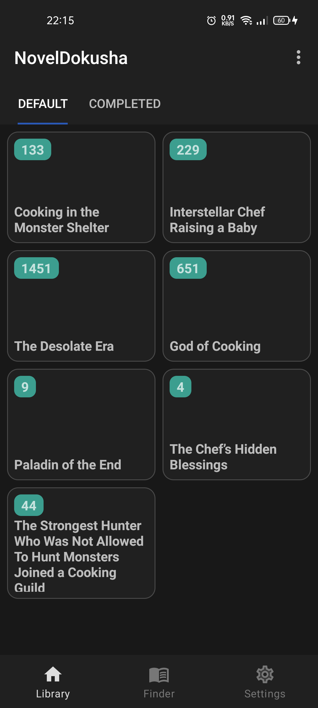
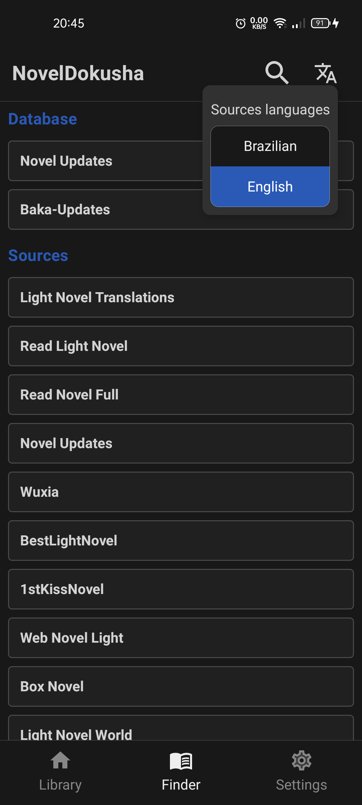
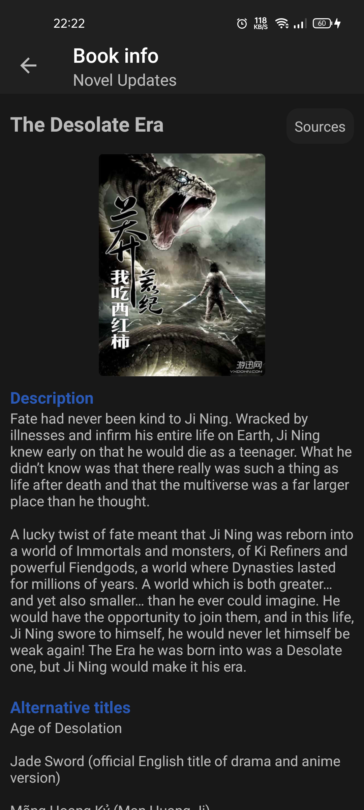
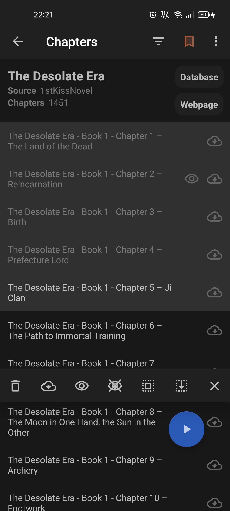
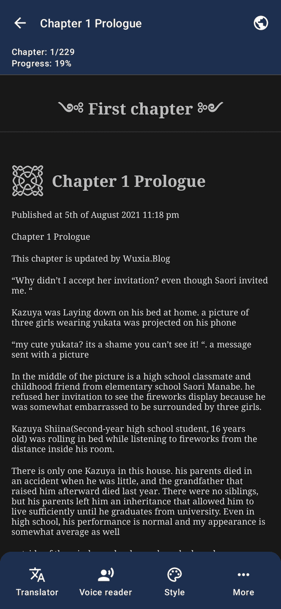

# NovelDokusha
Android web novel reader. Reader focused on simplicity, improving read immersion.
Search from a large catalog of content, open your pick and just enjoy.

## Features
  - Two databases to search for web novels (by title or categories)
  - Multiple sources from where to read
  - Reader
    - Infinite scroll
    - Custom font
    - Custom font size
    - Live translation to more than 40 languages
  - Light and dark themes
  - Epubs importer (format won't be preserved)
  - Easy backup and restore (zip file of a database + images folder)
  - Currenlty has 6 english sources (default) and 1 brazilian.
  
## Screenshots
 
Library | Finder
:-------------------------:|:-------------------------:
  |  
Book info | Book chapters
  |  
Reader | 
  |   

## Tech stack
  - Kotlin
  - Jetpack compose  
  - Coroutines
  - LiveData
  - Room (SQLite)
  - Jsoup
  - Coil  
  - Gson
  - Google MLKit for translation

## License
  - GPL-3 FOSS
